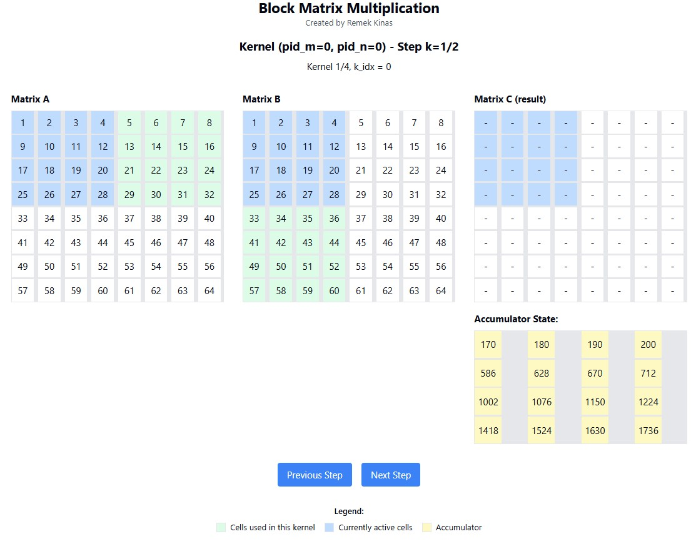
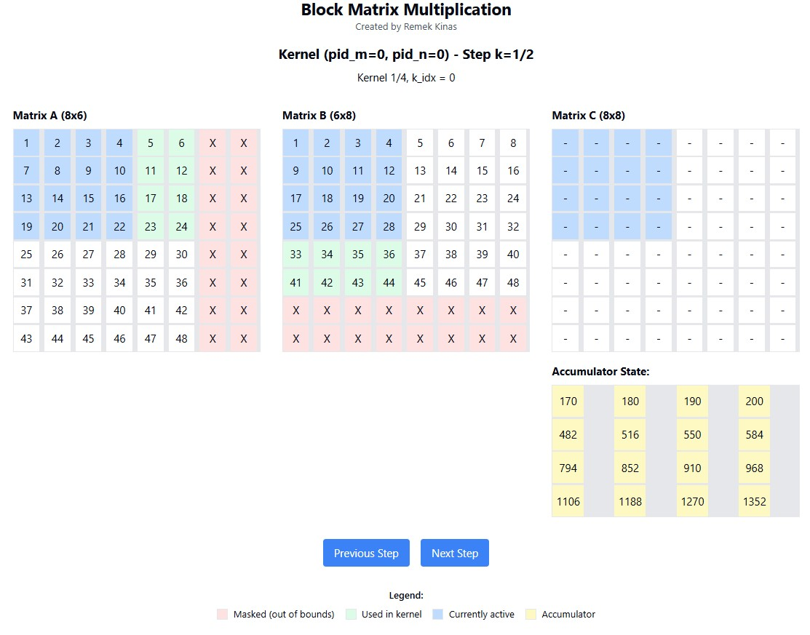

# Matrix Multiplication with Triton

This repository demonstrates matrix multiplication using the Triton framework. We provide two examples:

1. **Naive Matrix Multiplication (8x8)**: A straightforward implementation of matrix multiplication without masking.
2. **Masked Matrix Multiplication (8x6)**: An enhanced implementation showcasing the use of masking to handle uneven matrix sizes.

## Visualization

### Naive Matrix Multiplication (8x8)
[View Visualization](https://claude.site/artifacts/1f66d58b-5c1e-4a88-8bb4-ddb47ed9bda1)



### Masked Matrix Multiplication (8x6)
[View Visualization](https://claude.site/artifacts/cc485433-bc54-4af4-830f-50ac4f3eefca)



## Implementation

The examples are implemented using the Triton framework. Below is a clean and concise implementation of the naive matrix multiplication kernel and its corresponding Python integration:

```python
import torch
import triton
import triton.language as tl
from functools import partial

DEVICE = 'cuda'

@triton.jit
def naive_matmul_kernel(
    a_ptr, b_ptr, c_ptr,
    m, n, k,
    stride_am, stride_ak,
    stride_bk, stride_bn,
    stride_cm, stride_cn,
    bm: tl.constexpr, bn: tl.constexpr, bk: tl.constexpr
):
    # Program IDs
    pid_m, pid_n = tl.program_id(0), tl.program_id(1)

    # Block-level starting indices
    rm = pid_m * bm + tl.arange(0, bm)
    rn = pid_n * bn + tl.arange(0, bn)
    rk = tl.arange(0, bk)

    # Boundary masks
    rm_mask = rm < m
    rn_mask = rn < n

    # Offsets
    offs_a = a_ptr + rm[:, None] * stride_am + rk[None, :] * stride_ak
    offs_b = b_ptr + rk[:, None] * stride_bk + rn[None, :] * stride_bn

    # Accumulator
    acc = tl.zeros((bm, bn), dtype=tl.float32)

    # Loop over the k dimension
    for k_idx in range(0, k, bk):
        k_mask = k_idx + rk < k
        a = tl.load(offs_a, mask=rm_mask[:, None] & k_mask[None, :], other=0.0)
        b = tl.load(offs_b, mask=k_mask[:, None] & rn_mask[None, :], other=0.0)
        acc += tl.dot(a, b)

        # Increment offsets
        offs_a += bk * stride_ak
        offs_b += bk * stride_bk

    # Write back results
    c = c_ptr + rm[:, None] * stride_cm + rn[None, :] * stride_cn
    tl.store(c, acc, mask=rm_mask[:, None] & rn_mask[None, :])

# Python interface
def matmul(a, b, kernel, block_size=32):
    m, k = a.shape
    _, n = b.shape
    
    c = torch.empty((m, n), device=a.device, dtype=a.dtype)

    grid = lambda meta: (triton.cdiv(m, meta['bm']), triton.cdiv(n, meta['bn']))

    kernel[grid](
        a, b, c,
        m, n, k,
        a.stride(0), a.stride(1),
        b.stride(0), b.stride(1),
        c.stride(0), c.stride(1),
        bm=block_size, bn=block_size, bk=block_size
    )

    return c

naive_matmul = partial(matmul, kernel=naive_matmul_kernel)

# Example usage
a = torch.ones((8, 8), dtype=torch.float32, device=DEVICE)
b = torch.ones((8, 8), dtype=torch.float32, device=DEVICE)

result = naive_matmul(a, b, block_size=8)

expected = torch.matmul(a, b)
assert torch.allclose(result, expected, rtol=1e-3, atol=1e-3)
print("Test passed!")
```

## Key Features

- **Naive Implementation**: Demonstrates the basics of kernel programming with Triton.
- **Masked Implementation**: Illustrates handling of uneven matrices using boundary masks.

